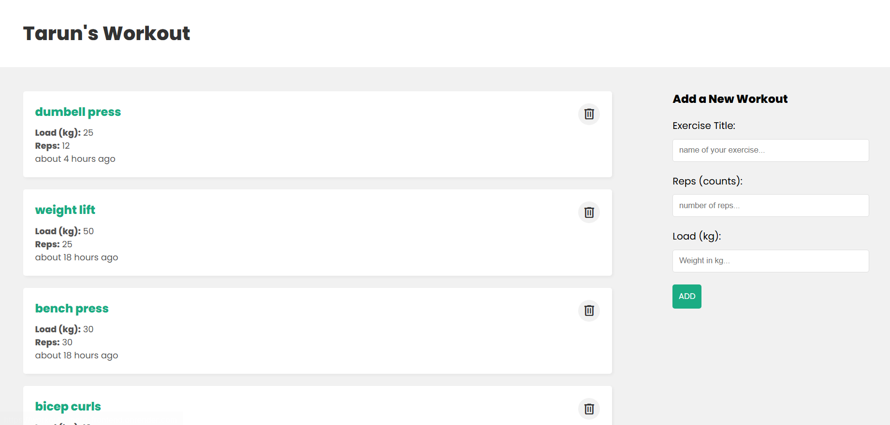

<div align="center">
  <h1 align="center">MERN Workout Tracker</h1>
  <p align="center">
    A full-stack web application for logging and tracking workouts, built with the MERN stack.
  </p>
</div>

<div align="center">
  <h3>Built With</h3>
  <p>
    
    
    
    
    
    
    
    
  </p>
</div>

---

**Live Demo:** [https://workouts-mern-frontend.onrender.com](https://workouts-mern-frontend.onrender.com)

<div align="center">



</div>

---

## Features

* **Full CRUD Functionality:** Create, Read, and Delete workouts.
* **Dynamic UI:** The user interface is built with React and updates in real-time without needing to reload the page.
* **State Management:** Utilizes React's Context API and the `useReducer` hook for efficient and predictable global state management.
* **RESTful API:** A robust backend built with Node.js and Express.js serves data to the frontend.
* **Formatted Timestamps:** Displays when each workout was created using the `date-fns` library for user-friendly time formatting.
* **Responsive Design:** The application is fully responsive and works seamlessly on desktop and mobile devices.

---

## Tech Stack

This project is built using the MERN stack and deployed on Render.

* **Frontend:**
    * React.js (Create React App)
    * React Hooks (useState, useEffect, useReducer, useContext)
    * React Context API for state management
    * `date-fns` for time formatting
    * CSS for styling

* **Backend:**
    * Node.js
    * Express.js
    * Mongoose

* **Database:**
    * MongoDB Atlas (Cloud Database)

* **Deployment:**
    * Render (for both frontend and backend)

---

## Getting Started

To get a local copy up and running, follow these simple steps.

### Prerequisites

Make sure you have Node.js and npm installed on your machine.
* npm
    ```sh
    npm install npm@latest -g
    ```

### Installation

1.  **Clone the repository**
    ```sh
    git clone https://github.com/murugaveltarun/workouts-mern.git
    cd workouts-mern
    ```

2.  **Setup the Backend (Server)**
    * Navigate to the backend directory and install NPM packages.
        ```sh
        cd backend
        npm install
        ```
    * Create a `.env` file in the `backend` directory and add the following environment variables.
        ```
        PORT=4000
        MONGO_URI=your_mongodb_atlas_connection_string
        ```
    * Start the backend server.
        ```sh
        npm run dev
        ```
    The server will start on `http://localhost:4000`.

3.  **Setup the Frontend (Client)**
    * Open a new terminal, navigate to the frontend directory, and install NPM packages.
        ```sh
        cd frontend
        npm install
        ```
    * Start the frontend development server.
        ```sh
        npm start
        ```
    The React application will open in your browser at `http://localhost:3000`.

---

## API Endpoints

The backend provides the following RESTful API endpoints for managing workouts:

| Method | Endpoint             | Description                  |
| :----- | :------------------- | :--------------------------- |
| `GET`    | `/api/workouts`      | Get all workouts             |
| `GET`    | `/api/workouts/:id`  | Get a single workout by ID   |
| `POST`   | `/api/workouts`      | Create a new workout         |
| `DELETE` | `/api/workouts/:id`  | Delete a workout by ID       |
| `PATCH`  | `/api/workouts/:id`  | Update a workout by ID       |
